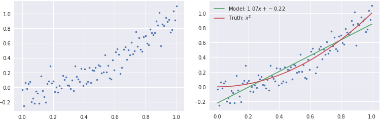
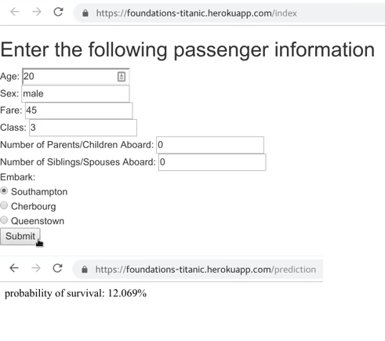
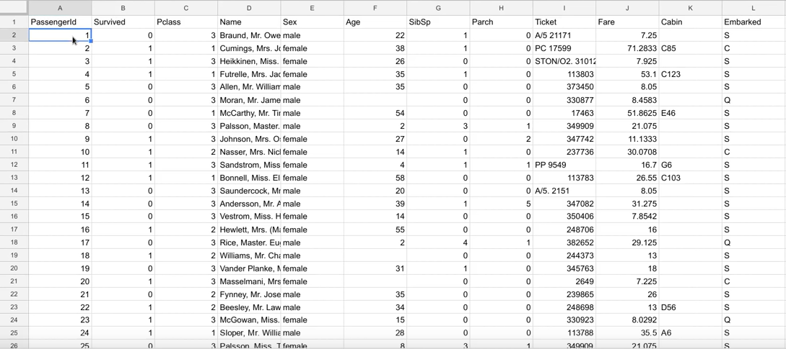
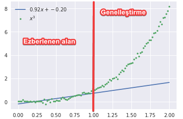

# 🙋‍ Makine Öğrenimine Giriş

## 👀 Kavramlara Göz Atalım

- Öğrenmeyi, daha önceki tecrübelerimizden yola çıkarak, yeni olaylar için öngörüde bulunmak olarak nitelendirebiliriz
  - Örneğin otobüse her seferinde geç kalma durumunda, biraz daha erken çıkmamız gerektiğini öğrenebiliriz
- Genelde insanların öğrenme hususunda makinelerden daha hızlı olduğu söylense de, makineler çok yüksek miktardaki verileri daha iyi öğrenirler
  - Bu veriler `csv` dosyaları veya resimler olabilir

## 🎯 Makine Öğreniminin Amacı

- Daha önceden sahip olduğumuz verileri analiz etme ve anlama
- Bu anlayışı kullanarak anlamsız verileri mantıksal olarak anlamlandırma
- Örnek olarak "Kedi resimlerini öğrenip, kedileri bulan bir model" verilebilir

> Verilerin aynı dağıtımdan olması gerektiğini unutmayalım. Kedileri öğretip, köpekleri bulması beklenilemez.

## 💪 Makine Öğreniminin Gücü

Makine öğreniminin gücü iki temel sebebe dayanır

- Günümüzde, çok yüksek miktarda üretilen verilere
- Gelişen bilgisayar teknolojisi işlem gücünün artmasına

## 🌟 Makine Öğrenimi Uygulamalarına Örnekler

### 📈 Grafiksel Bir Örnek

Soldaki tablo verilerinden oluşan bir seti makineye öğrettiğimizde:

- Sağdaki yeşil çizgi makinenin öngördüğü sınırdır
  - Bu sınırın altında kalanlar Kedi, üstünde kalanlar Köpek olarak nitelendirilebilir
- Sağdaki kırmızı çizgi ise gerçek sınır çizgisini temsil eder

> Bu öğrenme yönetimi **Lineer Regression** olarak adlandırılmaktadır.

### 🚢 Online Bir Örnek

Alttaki uygulama verilen tablodaki verileri öğrenen bir modelin çalışmasına örnektir

 

## 🌌 Makine Öğrenimi Öğrenme Tipleri

| Supervised                                    | Unsupervised                                                |
| --------------------------------------------- | ----------------------------------------------------------- |
| Daha önceden anlamlandırılmı verileri öğrenme | Anlamlandırılmamış verilerden anlam ve benzerlik bulma      |
| Fotoğrafların kedi olduğu bilinir             | Fotoğrafların ne olduğu bilinmez                            |
| Temel amacı öğrenmektir                       | Temel amacı gruplamaktır                                    |
| Öğrendiği verilerin ne olduğunu bilir         | Verilerin ne olduğunu bilmez sadece benzer olanları gruplar |

> Bizim odaklanacağımız teknik **Supervised Learning** tekniğidir.

### 👨‍🏫 Supervised Learning

Temel amaç, verilen $$X$$ ile istenen $$Y$$ yi bulmaktır.

$$ f(x) \approx y $$

- $$X$$, **feature matrix** olarak adlandırılan özellik matriksi
- $$Y$$, **labels** olarak adlandırılan x'in anlamlandırılmış halidir

## 🐞 Makine Öğrenimindeki Sıkıntılar

Makine öğrenimi sonucunda oluşan modeller verileri genelleştirmede yeteri kadar başarılı olmayabilmekte

- Sadece verilen bilgilerden öğrendikleri için sınırlı tahminler yapabilmekteler
- Ayrıca verilen bilgileri aşırı öğrenmeleri (**overfitting**) durumunda genelleştirmede zayıf kalmaktadır

## 🔗 Harici Bağlantılar

- [📜 Intro to Machine Learning](../1%20-%20E%C4%9Fitici%20Notebooklar/0%20-%20Intro%20to%20Machine%20Learning.ipynb)
- [📺 WQU ML lecture 01](https://www.youtube.com/watch?v=9J6FNvil6Gw&feature=youtu.be)
- [📊 WQU Data Science](https://wqu.org/programs/data-science)
