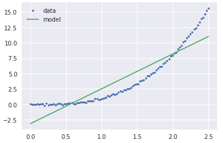
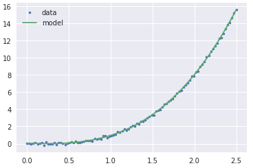
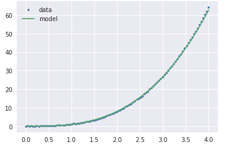

# 📉 Scikit-Learn

## ❔ Scikit-Learn Nasıl Çalışır?

Tabloda verilen `Estimator` class yapısını kullanınır

| Obje      | Terminolojisi   | Açıklama         |
| --------- | --------------- | ---------------- |
| `X`       | Featured matrix | Özellik matriksi |
| `Y`       | Label vector    | Etiket vektörü   |
| `fit`     |                 | eğitim metodu    |
| `predict` |                 | tahmin metodu    |

## 👶 Scikit-Learn Basit Kullanım

```py
from sklearn.linear_model import LinearRegression
lr = LinearRegression(fit_intercept=True, normalize=False)
lr.fit(X.reshape(-1, 1), y)
lr.coef_, lr.intercept_

predictions = lr.predict(X.reshape(-1, 1))
plt.plot(X, y, '.', label='data')
plt.plot(X, predictions, label='model')
plt.legend();
```



## 👨‍💻 Scikit-Learn PipeLine Kullanımı

```py
from sklearn.pipeline import Pipeline
from sklearn.preprocessing import PolynomialFeatures

pipe = Pipeline([
    ('polynomial_transform', PolynomialFeatures(3)),
    ('linear_fit', LinearRegression())
])

pipe.fit(X.reshape(-1, 1), y)

predictions = pipe.predict(X.reshape(-1, 1))
plt.plot(X, y, '.', label='data')
plt.plot(X, predictions, label='model')
plt.legend();
```



## 🦋 Genelleştirme Yapılması Durumunda SciKit-Learn Performansı

```py
X = np.linspace(0, 4, 100)
y = X**exp + np.random.randn(X.shape[0])/10
predictions = pipe.predict(X.reshape(-1, 1))
plt.plot(X, y, '.', label='data')
plt.plot(X, predictions, label='model')
plt.legend()
```



## 🔗 Harici Bağlantılar

- [📜 Intro to Machine Learning](../1%20-%20E%C4%9Fitici%20Notebooklar/0%20-%20Intro%20to%20Machine%20Learning.ipynb)
- [📊 WQU Data Science](https://wqu.org/programs/data-science)
