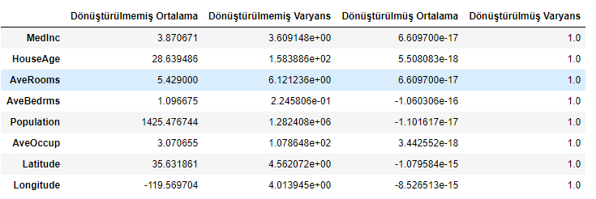

# 📉 SciKit-Learn

## 🤖 Model Metodları

| Metod         | Açıklama                                                 |
| ------------- | -------------------------------------------------------- |
| `fit(x, y)`   | Modeli veriyle eğitmek                                   |
| `predict(X)`  | Modelin tahmin etmesi                                    |
| `score(X, y)` | Tahmin skorunu (ihtimalini) verir                        |
| `coef_`       | Ağırlık katsayılarının ($$ß_{1...n}$$) değerlerini verir |
| `intercept_`  | Sabit sayı (bias $$ß_0$$) değerini verir                 |

### 🎳 Ağırlık ve Bias Değerlerine Örnek

$$ y(X) = \beta_1 x_1 + \beta_2 x_2 + \beta_3 x_3 + \beta_4 x_4 + \beta_5 x_5 + \beta_6 x_6 + \beta_7 x_7 + \beta_8 x_8 + \beta_0. $$


```py
print("β_0: {}".format(model.intercept_))
for i in range(8):
    print("β_{}: {}".format(i+1, model.coef_[i]))
```

```py
β_0: -36.94192020718441
β_1: 0.4366932931343245
β_2: 0.009435778033237972
β_3: -0.10732204139090447
β_4: 0.645065693519812
β_5: -3.976389421211576e-06
β_6: -0.003786542654971
β_7: -0.42131437752714385
β_8: -0.43451375467477743
```

## 💫 Transformers (Dönüştürücüler)

Makine öğrenimi için her zaman veriler istenildiği düzende olmaz, bu durumlarda **Transformers**'lar kullanılır

- Temel amacı verileri benzer hale  getirmektir
  - Verilerin benzer olması makine öğrenimi her zaman **hızlandırır**
- Verileri aynı ölçekte alttaki koşullara göre düzenler (**normalizasyon** denebilir (?))
  - Aritmatik Ortalaması = 0
  - Varyansı = 1
    - Varyans, bir serinin aritmatik ortalaması üzerinde dağılımıdır
    - [Varyans hesaplama](https://www.wikihow.com.tr/Varyans-Nas%C4%B1l-Hesaplan%C4%B1r)

```py
from sklearn.preprocessing import StandardScaler

# create and fit scaler
scaler = StandardScaler()
scaler.fit(X)

# scale data set
Xt = scaler.transform(X)

# create data frame with results
stats = np.vstack((X.mean(axis=0), X.var(axis=0), Xt.mean(axis=0), Xt.var(axis=0))).T
feature_names = data['feature_names']
columns = ['Dönüştürülmemiş Ortalama', 'Dönüştürülmemiş Varyans', 'Dönüştürülmüş Ortalama', 'Dönüştürülmüş Varyans']

df = pd.DataFrame(stats, index=feature_names, columns=columns)
df
```



### 🧱 Transformers Metodları

| Metod              | Açıklama                                 |
| ------------------ | ---------------------------------------- |
| `fit(x, y)`        | Modeli veriyle eğitmek                   |
| `transform(X)`     | Veriyi dönüştürmek ve verimli hale almak |
| `fit_transform(X)` | Önce `fit` ardından `transform` uygular  |

### 📊 ColumnTransformers

Sadece **belirlenen** sütünlara dönüştürme işlemi uygulamak için tercih edilir

```py
from sklearn.compose import ColumnTransformer

col_transformer = ColumnTransformer(
    remainder='passthrough',
    transformers=[
        ('scaler', StandardScaler(), slice(0,6)) # first 6 columns
    ]
)

col_transformer.fit(X)
Xt = col_transformer.transform(X)

print('MedInc mean before transformation?', X.mean(axis=0)[0]) # 3.8706710029069766
print('MedInc mean after transformation?', Xt.mean(axis=0)[0], '\n') # 6.609699867535816e-17

print('Longitude mean before transformation?', X.mean(axis=0)[-1]) # -119.56970445736432
print('Longitude mean after transformation?', Xt.mean(axis=0)[-1]) # -119.56970445736432

col_transformer = ColumnTransformer(
    remainder='passthrough',
    transformers=[
        ('remove', 'drop', 0),
        ('scaler', StandardScaler(), slice(1,6))
    ]
)

Xt = col_transformer.fit_transform(X)

print('Number of features in X:', X.shape[1]) # 8
print('Number of features Xt:', Xt.shape[1]) # 7
```

## 🍢 Pipeline

Birden fazla işlemleri **seri** olarak yapmayı sağlayan yöntemdir

```py
from sklearn.pipeline import Pipeline
from sklearn.preprocessing import PolynomialFeatures

# construct pipeline
scaler = StandardScaler()
poly_features = PolynomialFeatures(degree=2)
lin_reg = LinearRegression()

pipe = Pipeline([
    ('scaler', scaler),
    ('poly', poly_features),
    ('regressor', lin_reg)
])

print(pipe.named_steps)
# {'scaler': StandardScaler(copy=True, with_mean=True, with_std=True),
# 'poly': PolynomialFeatures(degree=2, include_bias=True, interaction_only=False,
#                  order='C'),
# 'regressor': LinearRegression(copy_X=True, fit_intercept=True, n_jobs=None, normalize=False)}

pipe.fit(X, y)
y_pred = pipe.predict(X)

print(y_pred) # [4.00298901 3.92349228 3.99012926 ... 0.83369975 0.88801566 0.97559649]
print("R^2: {}".format(pipe.score(X, y))) # R^2: 0.6832976293317492
```

