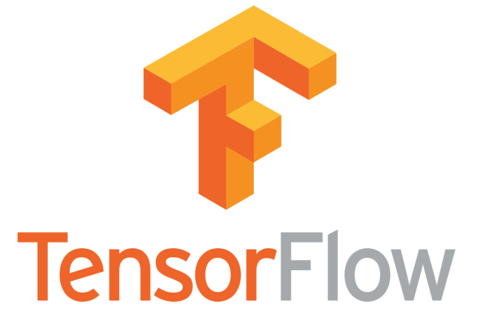
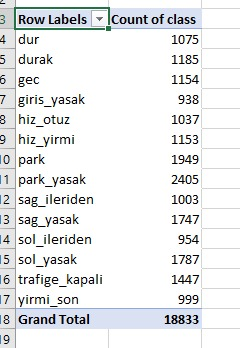

# 🕵️‍ Tensorflow Object Detection API ile Obje Bulma



## Temel Bilgiler

Bu notların PDF haline 📕 [buradan](.%5Cdocs%5CYTensorflow.pdf) erişebilirsin.

- Python dili üzerinde makine öğrenimi gibi işlemler için Google tarafından sunulan kütüphanedir.
- Yabancı Kaynaklar: [📺](https://youtu.be/COlbP62-B-U) [📄](https://buildmedia.readthedocs.org/media/pdf/tensorflow-object-detection-api-tutorial/latest/tensorflow-object-detection-api-tutorial.pdf)

### Hangi İşletim Sistemi Daha iyi

Linux daha iyidir 🐧

Kaynak için [buraya](https://www.quora.com/Is-Linux-better-than-Windows-for-using-TensorFlow) bakabilrisin.

## Tensorflow Kurulumu

- Tensorflow anaconda üzerinden daha sağlıklı, taşınabilir ve verimli çalışabilmekte
- Anacondanın sanal ortamları, paketlerin çakışmasını engelleyecektir
- Anaconda'nın tensorflowdaki avantajı için [buraya](https://www.anaconda.com/tensorflow-in-anaconda/) göz atabilirsin.

### Anaconda Kurulumu

- Anaconda kurulumu için [buraya](../Uygulama%20Notlar%C4%B1/Anaconda.md#anaconda-kurulumu) tıklayarak onun için hazırladığım dökümana erişebilirsin.

### Tensorflow CPU veya GPU Kurulumu

- Bu kurulum CPU kurulumu olarak da geçmekte
- GPU kurulumu CPU'ya nazaran oldukça hızlı eğitim seçeneği sağlar
- GPU kurulumu için gereksinimleri sağlıyorsanız GPU kurulumu (tensorflow-gpu) yapmanız tavsiye edilir

#### Sanal Ortam Oluşturma ve Üzerine Kurma

```cmd
conda create -n tensorflow tensorflow # CPU kurulumu
conda create -n tensorflow tensorflow-gpu # GPU kurulumu
```

### Kurulumu Test Etme

Alttaki komnut ile 'Hello, TensorFlow!' çıktısın almanız gerekmektedir.

```cmd
python -c
>>> import tensorflow as tf
>>> hello = tf.constant('Hello, TensorFlow!')
>>> sess = tf.Session()
>>> print(sess.run(hello))
```

<div class="page"/>

## Tensorflow Algılama Modellerinin Kurulumu

- Algılama modelleri tabloma erişmek için [buraya](detection_models\tensorflow_algılama_modelleri.pdf) tıklayabilirsin
  - Resmi sitesi için [buraya](https://github.com/tensorflow/models/blob/master/research/object_detection/g3doc/detection_model_zoo.md) bakabilirsin
- Video üzerinden açıklama için [buraya](https://youtu.be/COlbP62-B-U) bakabilirsin

> Resmi açıklamalar `models/research/object_detection/g3doc` dizinindedir.

### Gerekli Paketlerin Kurulumları

Tensorflow modellerini kullanabilmek için alttaki kurulumlara da ihtiyaç olabilmekte:

```cmd
conda install opencv pillow matplotlib pandas jupyter
```

> Modül bulunamaması gibi durumlarda `lxml`, `protobuf` paketlerini yüklemeyi deneyebilirsin.

#### Linux için OpenCv Kurulumu

GTK ve FFMPEG hatasını engellemek için pip ile kurulum yapın

```sh
pip install opencv-contrib-python
```

#### Script Dosyaları için Gerekli Modüller

```cmd
pip install pynput # detect_from_desktop
```

### Tensorflow Models İndirilmesi

Alttaki talimatler ve komutlar yardımıyla tensorflow modellerini kurun:

- Modelleri indirmek için [buraya](https://github.com/tensorflow/models/archive/master.zip) tıklayabilirsin
- İstersen [buraya](https://github.com/tensorflow/models) tıklayarak github linkine erişebilirsin
- İndirdiğiniz dosyanın içindekileri `models` dizinine koymanız gerekmektedir.

> Bu adından sonrası `models/research/` dizininde gerçekleştirilmelidir.

```cmd
powershell.exe Expand-Archive models-master.zip .
ren models-master models
move models %TENSORFLOW%
cd %TENSORFLOW%\models\research\
```

<div class="page"/>

#### Models Klasörü Yapısı

```txt
+ models
    + offical
    + research
    + sample
    ...
```

### Protobuflarların İşlenmesi

Protobuf dosyaları (`.proto` uzantılı olan dosyalar) python kodlanı oluşturmak için kullanılan dosyalardır. `TensorFlow/models/research/` dizininde

Windows:

```bat
for /f %i in ('dir /b object_detection\protos\*.proto') do protoc object_detection\protos\%i --python_out=.
```

Linux:

```sh
protoc object_detection/protos/*.proto --python_out=.
```

> Protobuflarların işlenmesiyle `.py` uzantılı dosyalar oluşacaktır

### Obje Algılama Kütüphanelerinin Derlenmesi ve Yüklenmesi

```sh
# TensorFlow/models/research/ dizininde
python setup.py build
python setup.py install
```

<div class="page"/>

### Gerekli Ortam Değişkenlerinin Tanımlanması

Eğer daha önceden tanımlı `PYTHONPATH` ortam değişkeniniz **yoksa ilk olan**, **varsa ikinci olan** komutu kullanın.

> Bu ortam değişkenlerinin **terminalin her açılışında yazılması** gerekmetedir.

```cmd
set PYTHONPATH=%TENSORFLOW%\models\research;%TENSORFLOW%\models\research\slim;%TENSORFLOW%\models\research\object_detection
```

```cmd
set PYTHONPATH=%PYTHONPATH%;%TENSORFLOW%\models\research;%TENSORFLOW%\models\research\slim;%TENSORFLOW%\models\research\object_detection
```

#### Anaconda Ortamı için Otomatik Tanımlama

- Her `conda activate <ortam_ismi>` komutu yazıldığında ortamlar dahil edilir
- Her `conda deactivate` yazıldığında ortamlar kaldırılır

##### Windows için Otomatik Tanımlama

```cmd
cd <conda_ortamı_yolu>
mkdir .\etc\conda\activate.d
echo set PYTHONPATH=%TENSORFLOW%\models\research;%TENSORFLOW%\models\research\slim;%TENSORFLOW%\models\research\object_detection > .\etc\conda\activate.d\env_vars.bat
```

##### Linux için Otomatik Tanımlama

Resmi kaynak için [buraya](https://conda.io/projects/conda/en/latest/user-guide/tasks/manage-environments.html#macos-and-linux) bakabilirsin.

```sh
cd <conda_ortamı_yolu>
mkdir -p ./etc/conda/activate.d
mkdir -p ./etc/conda/deactivate.d
echo export PYTHONPATH=${PYTHONPATH}:${TENSORFLOW}/models/research:${TENSORFLOW}/models/research/slim:${TENSORFLOW}/models/research/object_detection > etc/conda/activate.d/env_vars.sh
echo unset PYTHONPATH > etc/conda/deactivate.d/env_vars.sh
```

- `<conda_ortamı_yolu>` Conda ortamının kurulduğu yol
  - *Örn: %USERPROFILE%\Anaconda3\envs\tensorflow-cpu*

<div class="page"/>

### Modellerin Kurulumunu Test Etme

Jupyter notebook ile API'ları eval etmemzi gerekmekte.

```sh
cd object_detection
jupyter notebook
```

> Jupyter notebook hakkında bilgi sahibi değilsen [buraya](https://www.youtube.com/watch?v=COlbP62-B-U&feature=youtu.be&t=7m23s) tıklayarak ne yapman gerektiğini öğrenebilirsin.

## LabelImg Kurulumu

- LabelImg tensorflow modelleri için etiketleme amaçlı kullanılmaktadır
- Derlenmiş sürümünü indirmek için [buraya](http://tzutalin.github.io/labelImg/) tıklayabilirsin

> İndirilen dosyayı `%TENSORFLOW%\addons` dizinine atmanız daha verimli bir çalışma sağlayacaktır.

### LabelImg Kaynak Kodlarını Derleme

#### LabelImg için Sanal Ortam Oluşturma

Tensorflow ortamının alt paketlerini etkilememsi için ek bir sanal ortamda kurulum sağlamalıyız.

```sh
conda create -n labelImg pyqt # QT grafik kütüphanesi
conda activate labelImg
conda install -c anaconda lxml
```

#### LabelImg Paketlerini Kurma ve Derleme

Paketlerin kurulumu için alttaki talimatları sırayla uygulayın:

- LabelImg dosyalarını indirmek için [buraya](https://github.com/tzutalin/labelImg/archive/master.zip) tıklayın
- Diğer işlemler için indirdiğiniz dosya dizininde cmd açıp alttaki komutları yazın

```sh
# labelImg-master.zip dizininde
powershell.exe Expand-Archive labelImg-master.zip .
ren labelImg-master labelImg
mkdir %TENSORFLOW%\addons
move labelImg %TENSORFLOW%\addons
cd %TENSORFLOW%\addons\labelImg
pyrcc5 -o resources.py resources.qrc # QT grafiklerinin oluşturulması
```

> *'pyrcc5' is not recognized as an internal or external command* hatası gelirse, yüklediğiniz `pyqt` sürümüne göre komutu kullanın (`pyrcc<pyqt_sürümü_ilk_basamağı>`)

<div class="page"/>

#### LabelImg Kurulumunu Test Etme

```sh
conda activate tensorflow-cpu
cd %TENSORFLOW%\addons\labelImg
python labelImg.py
# python labelImg.py [IMAGE_PATH] [PRE-DEFINED CLASS FILE]
```

## Dizin Yapısını Oluşturma

### Tensorflow Dizininizi Geçici Ortam Değişkenlerine Ekleme

Alttaki komut yardımıyla açık olan cmd ekranına ortam değişkeni tanımlayabilirsiniz.

```cmd
set TENSORFLOW=<dizin_yolu>
```

- `<dizin_yolu>` Tensorflow'u kurmak istediğiniz dizin
  - *Örn: "C:\Tensorflow"*

### Tensorflow Dizininizi Kalıcı Olarak Ortam Değişkenlerine Ekleme

- Bilgisayarıma sağ tıklayın `Ayarlar` kısmına girin
- Sol alanda `Gelişmiş Sistem Ayarları`'na tıklayın
- Açılan ekranda `Ortam Değişkenleri` butonuna tıklayın
- Üst kısımdaki kullanıcı değişkenleri alanında `Yeni` butonuna tıklayın
- Değişken ismine: `Tensorflow` Değerine: 'dizin yolunuzu' yazın

### Temel Klasörlerin Oluşturulması

İlerideki yapı için bu dizinin yolu `%TENSORFLOW%` olarak ifade edilecektir.

Proje yapısı tavsiye edilen dizin yapısına örnek olacak şekilde oluşturulmuştur.

> Düzgün ve verimli çalışmak için buradaki yapıyı kullanmanız önerilir.

```bat
mkdir %TENSORFLOW%\workspace\example_detection
mkdir %TENSORFLOW%\workspace\example_detection\data
mkdir %TENSORFLOW%\workspace\example_detection\images\train
mkdir %TENSORFLOW%\workspace\example_detection\images\eval
mkdir %TENSORFLOW%\workspace\example_detection\models
```

<div class="page"/>

### Temel Dizin Yapısı

```txt
+ addons
+ docs
+ models
+ scripts
+ workspace
    + example_detection
        + data
        + models
            + <model_ismi>
                + eval
                + train
                - *.config
                ...
            + <model_ismi>
                + eval
                + train
                - *.config
                ...
            ...
        ...
    + example2_detection
        + data
        + models
            + <model_ismi>
                + eval
                + train
                - *.config
                ...
            + <model_ismi>
                + eval
                + train
                - *.config
                ...
            ...
        ...
    ...
```

| Dizin     | Açıklama                           |
| --------- | ---------------------------------- |
| addons    | LabelImg vs.                       |
| docs      | Dökümanlar                         |
| models    | Tensorflow Models dosyası          |
| scripts   | Kullanacağınız ortak kod parçaları |
| workspace | Çalışma Alanı                      |

<div class="page"/>

### Çalışma Alanı Yapısı

```txt
+ workspace
    + example_detection
        + data
        + models
        ...
    + example2_detection
        + data
        + models
        ...
    ...
```

| Dizin | Açıklama                                                                      |
| ----- | ----------------------------------------------------------------------------- |
| data  | Eğitime katılacak verileri (*eval.record, train.record, label_map*) içeririr. |
| model | Eğitilecek modellerin dosyalarını içerir.                                     |

### Data Dizini Yapısı

```txt
+ example_detection
    + data
        - label_map.pbtxt
        - eval.record
        - train.record
    + models
    ...
...
```

| Dosya             | Açıklama                                                  |
| ----------------- | --------------------------------------------------------- |
| `label_map.pbtxt` | Etiket haritası dosyası                                   |
| `eval.record`     | Test için kullanılacak tensorflow kayıtları (TF record)   |
| `train.record`    | Eğitim için kullanılacak tensorflow kayıtları (TF record) |

<div class="page"/>

### Models Dizini Yapısı

```txt
+ example_detection
    + data
    + models
        + <model_ismi>
            + eval
            + train
            - *.config
            ...
        + <model_ismi>
            + eval
            + train
            - *.config
            ...
        ...
    ...
...
```

Her bir model için ayrı dizinler oluşturulur.

| İsim      | Tipi  | Açıklama                        |
| --------- | ----- | ------------------------------- |
| eval      | Dizin | Test sonuçları burada tutulur.  |
| train     | Dizin | Eğitim çıktıları burada tutulur |
| `.config` | Dosya | Yapılandırma dosyası            |

<div class="page"/>

## Özelleştirilmiş Tensorflow Obje Algılayıcısı Eğitme

Özelleştirilmiş model eğitmek için alttakilerin yapılmış olması gerekmektedir:

- [Tensorflow CPU veya GPU kurulumu](#tensorflow-cpu-veya-gpu-kurulumu)
- [Tensorflow modellerinin kurulumu](#tensorflow-modellerinin-i%CC%87ndirilmesi)
- [LabelImg kurulumu](#labelimg-kurulumu)

### Resim Etiketleme İşlemi

Etiketleme işlemini **labelImg** üzerinden yapmaktayız.

#### Derlenmiş LabelImg

İndirdiğiniz dizindeki `labelimg.exe` dosyasını çalıştırmanız yeterlidir.

#### Python ile LabelImg

İşlemleri **Anconda Prompt** ile işlemler yapmalıyız.

```sh
conda activate labelImg
cd %TENSORFLOW%\addons\labelImg
python labelImg.py ..\..\workspace\example_detection\images # çıktıları hedefleme
```

> LabelImg kullanımı için [bu videoya](https://www.youtube.com/watch?v=K_mFnvzyLvc&feature=youtu.be&t=9m13s) bakabilirsin.

#### Etiket Yollarını veya Adlarını Düzenleme

XML ve resim dosyalarını başka bir yolda oluşturduyasan alttaki script yardımıyla düzeltebilirsin

- Script dosyasını [buraya](resources\xml_path_regulator.py) tıklayarak indirmeli ve gerekli dizine alttaki komutla koymalıyız
- Komutları **Anaconda Prompt** üzerinden **tensorflow** ortamını aktif ederek uygulamayı unutmayın.

```sh
# Train verilerini yeniden adlandırma ve düzeltme
python xml_path_regulator.py -i %TENSORFLOW%\workspace\example_detection\images\train -p train

# Test verilerini yeniden adlandırma ve düzeltme
python xml_path_regulator.py -i %TENSORFLOW%\workspace\example_detection\images\eval -p eval
```

<div class="page"/>

### Etiket Haritası Oluşturma

- Alttaki komutla açılan dizinde `.pbtxt` uzantılı etiket haritası dosyasısı oluşturun
- Örnek dosya yapısı komutların altındadır.

```sh
cd %TENSORFLOW%\workspace\example_detection\annotations
start .
```

```js
item {
  id: 1
  name: 'cat'
}
item {
  id: 2
  name: 'dog'
}
```

- `cat` ve `dog` etiket isimleridir

### Tensorflow Kayıtları Oluşturma

- **Resim** verileri toplanır veya çekilir.
- Toplanan resimler `labelimg` yardımıyla etiketlenir ve `.xml` uzantılı dosyaları oluşturulur.
- `images` dizinine **resimler** ve onlara ait **xml** dosyaları %80'i train %20'i eval olacak şekilde klasörlere ayrılarak yerleştirilir.
- `scripts/preprocessing` dizindeki `xml_path_regulator.py` scripti aracılığıyla xml ve resimlerde yol sorunları düzeltilir, veriler yeniden adlandırılır.
- `scripts/preprocessing` dizindeki `xml_to_csv.py` scripti aracılığıyla veriler `.csv` uzantılı tablosal bir dosyaya dönüştürülür.
- Oluşturulan **csv** dosyasında resimlerin etiketlerine göre sayıları [tablo](#Excel%20ile%20Tablo%20G%C3%B6sterimi) olarak gösterilir. (Excel yardımıyla)
- Verilerde denge durumunun (her veriden yaklaşık olarak aynı sayıda varsa) kontrolü yapılır.
- Her çeşit veri için bir `id` belirtilecek şekilde `label_map.pbtxt` adlı etiket haritası oluşturulur
- Oluşturulan **csv**, **etiket haritası** ve **resim** verileri `scripts/preprocessing` dizindeki `generate_tfrecord.py` scripti aracılığıyla veriler `.record` uzantılı kayıtlara dönüştürülür.
- Seçilen modele özgü yapılandırma dosyası indirilir.
- Yapılandırma dosyası olan `*.config` dosyasındaki `PATH_TO_CONFIGURED` olarak işaretlenen alanlar, `num_classes`, `num_examples` ve `batch_size` değerleri güncellenir.
  - `num_examples` eval dizindeki resim sayısıdır (toplam class sayısı değil)

<div class="page"/>

#### Resimlerdeki Hataları Bulma

Resimlerde hata olduğu zaman eğitim aşamasında tensorflow modeli çalışma hatası vermektedir. Resimleri kontrol etmek için [buradaki](scripts\preprocessing\check_images.py) scripti alttaki komutlarla kullanabilirsiniz.

```bat
python scripts\preprocessing\check_images.py -i workspace\example_detection\images\train

python scripts\preprocessing\check_images.py -i workspace\example_detection\images\eval
```

#### Verileri Yeniden Adlandırma ve XML Hatalarını Düzeltme

LabelImg ile etiketlediğiniz resimleri farklı bir dizine taşımanız durumunda XML dosyalarındaki yollar uyuşmayacaktır. XML dosya yollarını düzeltmek, etiketsiz resimleri görüntülemek için [buradaki](scripts\preprocessing\xml_path_regulator.py) script dosyamı alttaki komutlar ile kullanabilirsiniz.

```bat
python scripts\preprocessing\xml_path_regulator.py -i %TENSORFLOW%\workspace\example_detection\images\train  -p train

python scripts\preprocessing\xml_path_regulator.py -i %TENSORFLOW%\workspace\example_detection\images\eval  -p eval
```

#### Etiketlenmemiş Resimleri Bulma

Etiketlenmemiş resimleri [buradaki](scripts\preprocessing\find_unlabeled_imgs.py) script dosyası ile alttaki komutlar ile kullanabilirsiniz.

> Eğer XML scriptini kullandıysanız bu kontrolü yapmanıza **gerek yoktur**, XML scripti bunu zaten yapmaktadır.

```bat
python scripts\preprocessing\find_unlabeled_imgs.py -i %TENSORFLOW%\workspace\example_detection\images\train

python scripts\preprocessing\find_unlabeled_imgs.py -i %TENSORFLOW%\workspace\example_detection\images\eval
```

<div class="page"/>

#### XML'i CSV'ye Çevirme

XML dosyalarını CSV dosyasında toparlamak için [buradaki](scripts\preprocessing\xml_to_csv.py) scripti alttaki komutlar ile kullanabilirsin.

> Komutları **Anaconda Prompt** üzerinden **tensorflow** ortamını aktif ederek uygulamayı unutmayın.

```sh
# Create train data:
python scripts\preprocessing\xml_to_csv.py -i %TENSORFLOW%\workspace\example_detection\images\train -o %TENSORFLOW%\workspace\example_detection\images\train_labels.csv

# Create eval data:
python scripts\preprocessing\xml_to_csv.py -i %TENSORFLOW%\workspace\example_detection\images\eval -o %TENSORFLOW%\workspace\example_detection\images\test_labels.csv
```

#### CSV'lerden Resim Bilgilerini Analiz Etme

Her bir etiketten kaç tane olduğunu anlamak için csv dosyalarını açıp alltaki yöntemi uygulayın.

- `class` hücresiinin bir altındaki hücreyi seçin
- `ctrl` + `shift` + `aşağı ok` ile tüm sınıf verilerini seçin
- Sağ alttaki butona tıklayın
- `Tables` sekmesine gelin
- Açılan sekmede `Pivot Table` butonuna tıklayın
- Tablo'dan etiketlenen verileri kontrol edin
- Fazladan etiketlenmiş verilerin ismini bulup, filename, width vs. verilerin yazıldığı alanda `CTRL` + `F` komutu ile aratıp, uygun dosya ismini ve `xml` dosyasını silin





<div class="page"/>

#### CSV'yi Record'a Çevirme

CSV dosyalarını TF kayıtlarına çevirmek için [buradaki](scripts\preprocessing\generate_tfrecord.py) scripti alttaki komutlar ile kullanabilirsin.

> Komutları **Anaconda Prompt** üzerinden **tensorflow** ortamını aktif ederek uygulamayı unutmayın.

```bat
python generate_tfrecord.py --label_map=%TENSORFLOW%\workspace\example_detection\data\label_map.pbtxt --csv_input=%TENSORFLOW%\workspace\example_detection\images\train_labels.csv --img_path=%TENSORFLOW%\workspace\example_detection\images\train --output_path=%TENSORFLOW%\workspace\example_detection\data\train.record

python generate_tfrecord.py --label_map=%TENSORFLOW%\workspace\example_detection\data\label_map.pbtxt --csv_input=%TENSORFLOW%\workspace\example_detection\images\test_labels.csv --img_path=%TENSORFLOW%\workspace\example_detection\images\eval --output_path=%TENSORFLOW%\workspace\example_detection\data\eval.record
```

### Bağlantıları (pipeline) Yapılandırma

- Tensorflow'un resmi açıklaması için [buraya](https://github.com/tensorflow/models/blob/master/research/object_detection/g3doc/configuring_jobs.md) tıklayabilirisin

#### Modellin İndirilmesi ve Gerekli Yere Taşınması

- Tensorflow önceden eğitilmiş modelleri indirmek için [buraya](https://github.com/tensorflow/models/blob/master/research/object_detection/g3doc/detection_model_zoo.md#coco-trained-models-coco-models) tıklayabilrisin
- `.tar.gz` uzantılı olacağı için [winrar](https://www.win-rar.com/download.html?&L=0) ya da [7zip](https://www.7-zip.org/download.html) gibi ek uygulamalarla `buraya çıkart` demen gerekmekte
  - `Klasör'e çıkart` değil `buraya çıkart` diyeceksiniz.

> Klasör içinde aynı isimde başka klasör olmasın

```sh
# Modelin çıkartıldığı dizinde
cd <model_ismi>
move * %TENSORFLOW%\workspace\example_detection\pre_trained_model
move saved_model %TENSORFLOW%\workspace\example_detection\pre_trained_model
cd %TENSORFLOW%\workspace\example_detection\pre_trained_model
```

- `<model_ismi>` Seçip, indirdiğiniz `.tar.gz` uzantılı dosyanın adı
  - `TAB` tuşu ile dizindeki dosya adlarını tamamlayabilirsiniz
  - `*.tar.gz` uzantısı yazılmayacak
  - *Örn: ssd_inception_v2_coco_2018_01_28*
  - *Örn: ssd_mobilenet_v1_ppn_shared_box_predictor_300x300_coco14_sync_2018_07_03*

<div class="page"/>

#### Modellin Yapılandırma Dosyaları

Seçtiğiniz modelin `*.config` dosyasını `example_detection/training` klasörü altına kopyalamanız gerekmekte.

```sh
mkdir %TENSORFLOW%\workspace\example_detection\training

copy %TENSORFLOW%\models\research\object_detection\samples\configs\<model_ismi>.config %TENSORFLOW%\workspace\example_detection\training
```

- `<model_ismi>` Seçip, indirdiğiniz `.tar.gz` uzantılı dosyanın adı
  - `TAB` tuşu ile dizindeki dosya adlarını tamamlayabilirsiniz
  - `*.tar.gz` uzantısı yazılmayacak
  - Tarih son ekini içermemeli
    - `*_2018_07_03.tar.gz` ise `*.tar.gz` olarak yazılmalı
  - *Örn: ssd_inception_v2*
  - *Örn: ssd_mobilenet_v1_ppn_shared_box_predictor_300x300_coco14_sync*

#### Modelin Yapılandırma Dosyasını Düzenleme

Yapılandırma örnek dosyası için [buraya](workspace\traffic_light_detector\training\ssd_mobilenet_v2_coco.config) bakabilirsin.

| Düzenlenecek Satır     | Açıklama               | Örnek                              |
| ---------------------- | ---------------------- | ---------------------------------- |
| `num_classes`          | Etiket türü sayısı     | `2`                                |
| `batch_size`           | Toplu işleme boyutu    | `24`                               |
| `num_steps`            | Adım sayısı            | `2000`                             |
| `fine_tune_checkpoint` | Eğitilmiş modelin yolu | `"./pre_trained_model/model.ckpt"` |
| `label_map_path`       | Etiket haritası yolu   | `"./annotations/train.record"`     |
| `input_path`           | Train dosyası yolu     | `"./annotations/train.record"`     |
| `input_path`           | Test dosyası yolu      | `"./annotations/eval.record"`      |

<div class="page"/>

### Modeli Eğitme

Modeli eğitmek için `train.py` script dosyasını kullanacağız.

> Modeli önerilen dosya olan `model_main.py` ile eğitmek için [buraya](#modeli-modelmainpy-dosyas%C4%B1-ile-e%C4%9Fitme) bakmalısın.

#### Eğitim Scriptlerini Çalışma Alanına Kopyalama

Çalışma ortamının düzgün ilerlemesi adına alttaki komut ile gerekli yere scripti kopyalayalım

```sh
copy %TENSORFLOW%\models\research\object_detection\legacy\train.py %TENSORFLOW%\workspace\example_detection
copy %TENSORFLOW%\models\research\object_detection\model_main.py
```

#### Eğitimde Raporlanacak Seviyeyi Ayarlama (isteğe Bağlı)

Eğitimde uyarı ve bilgileri gizlemek için `TF_CPP_MIN_LOG_LEVEL` adlı ortam değişkeni oluşturup seviyesini tanımlıyoruz

```sh
set TF_CPP_MIN_LOG_LEVEL=2
```

#### Modeli train.py Dosyası ile Eğitime

`# TODO Daha düzgün ve detaylı linkli bir yazı ekle`

> Eskimiş olan bir eğitim kodudur, `model_main.py` kod dosyası tensorflow tarafından önerilir.

```sh
python train.py --logtostderr --train_dir=training/ --pipeline_config_path=training\<yapılandırma_dosyası>
```

- `<yapılandırma_dosyası>` Modelimizin yapılandırma dosyasının tam adı
  - **training** klasörüne attığımız yapılandırma dosyaları
  - *Örn: ssd_inception_v2_coco.config*

<div class="page"/>

##### Eğitime Başladığında Gelen Örnek Çıktı

```sh
INFO:tensorflow:depth of additional conv before box predictor: 0
INFO:tensorflow:depth of additional conv before box predictor: 0
INFO:tensorflow:depth of additional conv before box predictor: 0
INFO:tensorflow:depth of additional conv before box predictor: 0
INFO:tensorflow:depth of additional conv before box predictor: 0
INFO:tensorflow:depth of additional conv before box predictor: 0
INFO:tensorflow:Restoring parameters from ssd_inception_v2_coco_2017_11_17/model.ckpt
INFO:tensorflow:Running local_init_op.
INFO:tensorflow:Done running local_init_op.
INFO:tensorflow:Starting Session.
INFO:tensorflow:Saving checkpoint to path training\model.ckpt
INFO:tensorflow:Starting Queues.
INFO:tensorflow:global_step/sec: 0
INFO:tensorflow:global step 1: loss = 13.8886 (12.339 sec/step)
INFO:tensorflow:global step 2: loss = 16.2202 (0.937 sec/step)
INFO:tensorflow:global step 3: loss = 13.7876 (0.904 sec/step)
INFO:tensorflow:global step 4: loss = 12.9230 (0.894 sec/step)
INFO:tensorflow:global step 5: loss = 12.7497 (0.922 sec/step)
INFO:tensorflow:global step 6: loss = 11.7563 (0.936 sec/step)
INFO:tensorflow:global step 7: loss = 11.7245 (0.910 sec/step)
INFO:tensorflow:global step 8: loss = 10.7993 (0.916 sec/step)
INFO:tensorflow:global step 9: loss = 9.1277 (0.890 sec/step)
INFO:tensorflow:global step 10: loss = 9.3972 (0.919 sec/step)
INFO:tensorflow:global step 11: loss = 9.9487 (0.897 sec/step)
INFO:tensorflow:global step 12: loss = 8.7954 (0.884 sec/step)
INFO:tensorflow:global step 13: loss = 7.4329 (0.906 sec/step)
INFO:tensorflow:global step 14: loss = 7.8270 (0.897 sec/step)
INFO:tensorflow:global step 15: loss = 6.4877 (0.894 sec/step)
```

<div class="page"/>

#### Modeli model_main.py Dosyası ile Eğitme

Bu dosya ile eğitim önerilen eğitim şeklidir.

- `train.py` ile eğitime nazaran, kaldığı yerden devam eder
  - 1000 adım yapıldıysa, ikinci eğitimi 1200 yaptığınızda 200 adım eğitir
  - `train.py` eğitiminde modelin sonucunun ayırılıp, sonuç üzerinden eğitim yapılması gerekir

> Eğitim dosyaları arasında **performans veya kalite farkı yoktur**, kaynak için [buraya](https://github.com/tensorflow/models/issues/6100) bakabilirsin.

##### Eğitim için Gereksinimlerin Kurulması

Eğitim için `pycocotools` kurulumu gereklidir

###### Windows için PyCocoTools Kurulumu

Windows desteğiyle kurulum yapmak için alttaki komutu koşturun

```sh
pip install git+https://github.com/philferriere/cocoapi.git#subdirectory=PythonAPI
```

> Açıklama için [buraya](https://github.com/philferriere/cocoapi) bakabilirsin.

###### Linux için Cocotools

```sh
git clone https://github.com/cocodataset/cocoapi.git
cd cocoapi/PythonAPI
make
cp -r pycocotools /content/models/research/
cd ../..
rm -rf cocoapi
```

<div class="page"/>

##### Eğitimi Hazırlama ve Başlatma

Resmi kaynağa ulaşmak için [buraya](https://github.com/tensorflow/models/blob/master/research/object_detection/g3doc/running_locally.md) bakabilirsin.

- `model_main.py` eğitim için önerilen dosyadır
- Varsayılan olarak ekrana raporlama yapmaz, yapmasını isterseniz [buraya](https://github.com/EdjeElectronics/TensorFlow-Object-Detection-API-Tutorial-Train-Multiple-Objects-Windows-10/issues/184#issuecomment-437811347) bakabilirsiniz

```sh
# From the tensorflow/models/research/ directory
PIPELINE_CONFIG_PATH={path to pipeline config file}
MODEL_DIR={path to model directory}
NUM_TRAIN_STEPS=50000
SAMPLE_1_OF_N_EVAL_EXAMPLES=1
python object_detection/model_main.py \
    --pipeline_config_path=${PIPELINE_CONFIG_PATH} \
    --model_dir=${MODEL_DIR} \
    --num_train_steps=${NUM_TRAIN_STEPS} \
    --sample_1_of_n_eval_examples=$SAMPLE_1_OF_N_EVAL_EXAMPLES \
    --alsologtostderr
```

#### Eğitimi Etkileyen Faktörler

Training times can be affected by a number of factors such as:

- The computational power of you hardware (either CPU or GPU): Obviously, the more powerful your PC is, the faster the training process.

- Whether you are using the TensorFlow CPU or GPU variant: In general, even when compared to the best CPUs, almost any GPU graphics card will yield much faster training and detection speeds. As a matter of
fact, when I first started I was running TensorFlow on my Intel i7-5930k (6/12 cores @ 4GHz, 32GB RAM)
and was getting step times of around 12 sec/step, after which I installed TensorFlow GPU and training the
very same model -using the same dataset and config files- on a EVGA GTX-770 (1536 CUDA-cores @
1GHz, 2GB VRAM) I was down to 0.9 sec/step!!! A 12-fold increase in speed, using a “low/mid-end”
graphics card, when compared to a “mid/high-end” CPU.

- How big the dataset is: The higher the number of images in your dataset, the longer it will take for the
model to reach satisfactory levels of detection performance.

- The complexity of the objects you are trying to detect: Obviously, if your objective is to track a black ball
over a white background, the model will converge to satisfactory levels of detection pretty quickly. If on
the other hand, for example, you wish to detect ships in ports, using Pan-Tilt-Zoom cameras, then training
will be a much more challenging and time-consuming process, due to the high variability of the shape and
size of ships, combined with a highly dynamic background.

- And many, many, many, more. . . .

<div class="page"/>

#### Eğitim İşlemini TensorBoard Kullanarak Takip Etme

**Anaconda Prompt** üzerinden alttaki komutlar uygulanır:

```sh
activate tensorflow_cpu # ya da gpu
tensorboard --logdir=training\
```

Alttaki gibi bir çıktı gelmesi gerekmekte:

```sh
TensorBoard 1.6.0 at http://YOUR-PC:6006 (Press CTRL+C to quit)
```

> Çıktıyı görüntülemek için verilen url'i tarayıcına kopyalaman yeterlidir.

#### Sonuç Grafiğini Dışarı Aktarma

**Anaconda Prompt** üzerinden alttaki komutlar uygulanır:

```sh
activate tensorflow_cpu # ya da gpu

copy %TENSORFLOW%\models\research\object_detection/export_inference_graph.py %TENSORFLOW%\workspace\example_detection

cd %TENSORFLOW%\workspace\example_detection

python export_inference_graph.py --input_type image_tensor --pipeline_config_path training/<yapılandırma_dosyası> --trained_checkpoint_prefix training/model.ckpt-<checkpoint> --output_directory trained-inference-graphs/output_inference_graph_v1.pb
```

- `<yapılandırma_dosyası>` Modelimizin yapılandırma dosyasının tam adı
  - **training** klasörüne attığımız yapılandırma dosyaları
  - *Örn: ssd_inception_v2_coco.config*
- `<checkpoint>` **example_detection/training** dizinindeki gösterilmek istenen adımın numarası
  - *Örn: 13302*

<div class="page"/>

## Hata Notları ve Açıklamaları

### 'conda' is not recognized as an internal or external command

`Anaconda Prompt` üzerinden terminal işlemlerinize devam etmeniz durumunda sorun gidecektir.

### '...' is not recognized as an internal or external command

[Gerekli Paketlerin Kurulumları](#gerekli-paketlerin-kurulumlar%C4%B1) tamamnlanmadığı için bu hata ile karşılaşıyor olabilirsiniz.

### 'ImportError: No module named' Hataları

PythonPath ayarlanmadığı için bu hata ile karşılaşmaktasınız.

```sh
set PYTHONPATH=%TENSORFLOW%\models\research;%TENSORFLOW%\models\research\slim;%TENSORFLOW%\models\research\object_detection
```

> Dökümandaki ilgili alana yönelmek için [buraya](#gerekli-ortam-de%C4%9Fi%C5%9Fkenlerinin-tan%C4%B1mlanmas%C4%B1) tıklayabilrisin.

### 'dict_keys' object does not support indexing

Açıklama linki için [buraya](https://github.com/tensorflow/models/pull/6044/files) bakabilirsin.

```sh
start %TENSORFLOW%\models\research\object_detection\models\feature_map_generators.py
```

- Satır 518'deki yere alttaki kodu yapıştırın

```py
image_features = image_features[list(image_features.keys())[0]]
```

### Object was never used (type <class 'tensorflow.python.framework.ops.Tensor'>)

> Yakında..

### 'unicodeescape' codec can't decode bytes in position

Modelinizin `.config` dosyanıza yazdığın tam yol verilerinde `\` yerine `/` veya `\\` kullanmalısınız.

### Allocation of X exceeds 10% of system memory

- Rastgeldiğim bu [kaynağa](https://github.com/tensorflow/tensorflow/issues/18736#issuecomment-385976699) göre **ssd_mobilenet_v2_coco modeline** özgü bir hatadır.
- Hatanın çözüm kaynağı için [buraya](https://github.com/tensorflow/tensorflow/issues/18736#issuecomment-388709455) tıklayabilirsin

<div class="page"/>

### google.protobuf.text_format.ParseError, Expected string but found

Config dosyalarının text editör üzerinden düzenlemesi durumunda, türkçe karakterler için text editörü yapıyı değiştirmekte ve tensorflow bunu algılayamamaktadır. Sorunu çözmek için alttakiler yardımıyla `.config` dosyasını düzenleyin:

- VsCode
- Notepad++
- Sublime
- Atom

> Harici kaynak için [buraya](https://github.com/tensorflow/models/issues/1897#issuecomment-313879598) bakabilirsin.

### Value Error: No Variable to Save

Model eğitimi yapıldığı sırada gelen bir hatadır, çözümü için `.config`dosyanızı bu şekilde düzenleyin:

```cfg
train_config: {
  ...
  fine_tune_checkpoint: "./pre_trained_model/model.ckpt"
  fine_tune_checkpoint_type:  "detection"
  ...
}
```

> `ssd_mobilenet_v1_quantized_300x300_coco14_sync` modelinde test edilmiştir.

## Colab Üzerinden Tensorflow Modelini Eğitme

Colab ücretsiz GPU sunduğu için çok hızlı bir eğitim imkanı sunar.

### Colab Eğitimi için Gereken Dosyalar

- label_map.pbtxt
- eval.record
- train.record
- *.config
- model_main.py (eskisi: train.py)
- export_inference_graph.py

### Colab Üzeriinden Eğitim Kodları

Detayları öğrenmek için [buraya](https://colab.research.google.com/drive/1JvMqUga8ALUF-YwPp4gPVZ8SjxsOoFad) tıklayarak colab notuma erişebilirsin.

## Web Kamerası Kullanarak Obje Tespit Etme

Script dosyasına [buraya](scripts\detection\detect_from_webcam.py) tıklayarak erişebilirsin

<div class="page"/>

## Harici Bağlantılar

- [Traffic Light Detection Using the TensorFlow* Object Detection API](https://software.intel.com/en-us/articles/traffic-light-detection-using-the-tensorflow-object-detection-api)
- [Tensorflow in Anaconda](https://www.anaconda.com/tensorflow-in-anaconda/)
- [Tensorflow create a tfrecords file from csv](https://stackoverflow.com/a/41465631/9770490)
- [Tensorflow Object Detection, error while generating tfrecord [TypeError: None has type NoneType, but expected one of: int, long]](https://stackoverflow.com/a/50299634/9770490)
- [Tensorflow Github Preparing Inputs](https://github.com/tensorflow/models/blob/master/research/object_detection/g3doc/using_your_own_dataset.md)
- [TensorFlow Object Detection API in 5 clicks from Colaboratory](https://medium.com/@nickbortolotti/tensorflow-object-detection-api-in-5-clicks-from-colaboratory-843b19a1edf1s)
  - [5steps_object_detection.ipynb](https://colab.research.google.com/drive/16QQtlCa4-p4zqxuhJ0U-vOAT5dU0txJV#scrollTo=XnBVJiIzYune)
  - [labels_analysis_object_detection.ipynb](https://colab.research.google.com/drive/1zAmmvXGKIsBlZnWW1ZqHvP1EuKo3h1ZA#scrollTo=smQWTwI7k4Bf)
- [Custom training: walkthrough](https://www.tensorflow.org/tutorials/eager/custom_training_walkthrough)
- [TensorBoard: Visualizing Learning](https://www.tensorflow.org/tensorboard/r1/summaries)
- [TPU'yu Bu kadar Popüler Kılan Nedir?](https://cloud.google.com/blog/products/ai-machine-learning/what-makes-tpus-fine-tuned-for-deep-learning)

### Başlangıç için İdeal Olanlar

- [Güncel Makaleler](https://cv-tricks.com/)
- [IBM Cloud üzerinden model](https://github.com/nheidloff/object-detection-anki-overdrive-cars)
- [Zero to Hero: Guide to Object Detection using Deep Learning: Faster R-CNN,YOLO,SSD](https://cv-tricks.com/object-detection/faster-r-cnn-yolo-ssd/)

## Önemli Notlar

- `train.py` işlemi için `images` dizinindeki resimlere ihtiyaç yok, tf_records'lar yeterlidir.

<div class="page"/>

## Karma Notlar

### TF Verilerini Alma

<https://www.tensorflow.org/tutorials/load_data/tf_records>

### Recover the images from the TFRecord file

```py
for image_features in parsed_image_dataset:
  image_raw = image_features['image_raw'].numpy()
  display.display(display.Image(data=image_raw))
```

## 💖 Destek ve İletişim

**The [MIT License](https://choosealicense.com/licenses/mit/) &copy; Yunus Emre Ak**

[][github]
[][linkedin]
[][website]
[][mail]
[][bağış anlık]

[][bağış aylık]

<!-- İletişim -->

[mail]: mailto::yedhrab@gmail.com?subject=YArtificalIntelligent%20%7C%20Github
[github]: https://github.com/yedhrab
[website]: https://yemreak.com
[linkedin]: https://www.linkedin.com/in/yemreak/
[bağış anlık]: https://gogetfunding.com/yemreak/
[bağış aylık]: https://www.patreon.com/yemreak/

<!-- İletişim Sonu -->
